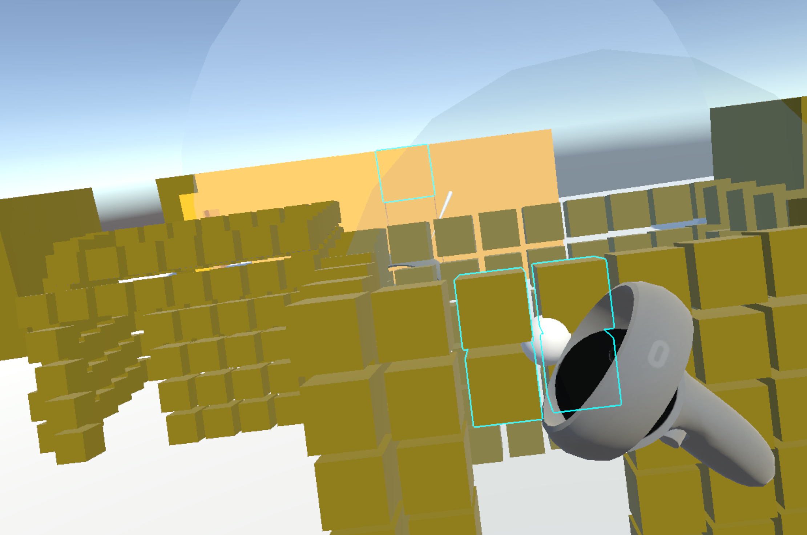
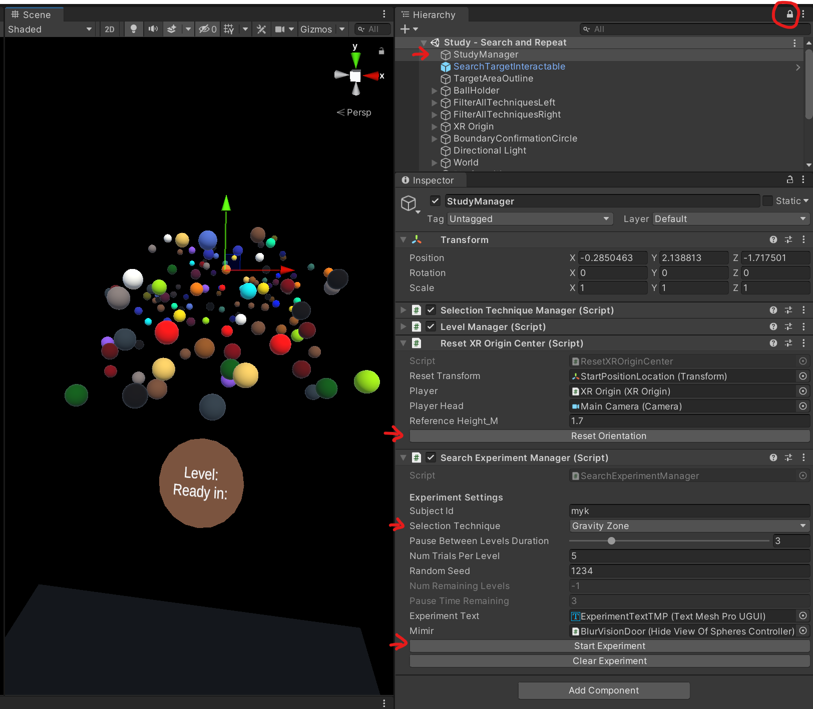

# Acquiring Occluded VR Objects Through an Interactive Mini-map

This repository contains the code for the disocclusion mini-map used in the paper "Toward Intuitive Acquisition of Occluded VR Objects Through an Interactive Disocclusion Mini-map" by Mykola Maslych, Yahya Hmaiti, Ryan Ghamandi, Paige Leber, Ravi Kiran Kattoju, Jacob Belga, and Joseph J. LaViola Jr. Visit our lab's page at [https://www.eecs.ucf.edu/isuelab/](https://www.eecs.ucf.edu/isuelab/). The paper was presented at the 2023 IEEE Conference Virtual Reality and 3D User Interfaces (VR).

## Installation and Usage

- Unity 2020.3.29f1 (but should work with any version of Unity above 2019)
- VR Headset (tested with Quest 2, 3, Pro)
- Oculus Quest Link must be enabled

## Scenes

### Study - Editor Eco Valid.unity



This scene allows you to explore the different techniques, switching between them with keyboard buttons:
* [T] CylinderPIM (3D Mini-map)
* [M] DiskPIM (Flat Mini-map with ambiguation)
* [W] DiskPIM (Flat Mini-map, no disambiguation)
* [F] Expand
* [R] RayKebab
* [G] GravityZone
* [Esc] Disable all

For CylinderPIM and DiskPIM, hold the `left front trigger` to highlight a part of the scene that you want displayed inside the mini-map. Release `left front trigger` to fix freeze the snapshot of highlighted objects. Use the `right grip` to grab minimized versions directly from the mini-map. For DiskPIM with disambiguation, press the `right front trigger` to freeze the disambiguated versions in-place around the left controller.

For RayKebab, minimized objects are grabbable directly from the ray using `right grip`.

For GravityZone, tilt joystick up and down to move objects closer and farther from the camera.

### Study - Search and Repeat.unity



This scene allows to run actual data collection process. Each trial consists of 2 phases: search and repeat. The idea is for the user to find the occluded magenta target object during search, then during the repeat phase, the taget object spawn in the same spot, but the user already knows where it is so directly selects it.

Open `StudyManager` object in inspector. During runtime:
* `Reset Orientation` re-centers the user in front of the scene.
* `Start Experiment` creates 15 trials (3 density levels * 5 trials per level) based on the settings in the `ExperimentManager.cs`, including the `Selection Technique` dropdown. When the study code is ran, trials must be created using this UI for each of the wanted techniques.
* Output is saved to `vr_selection/Assets/StreamingAssets/density_data/*`

### Gesture Customization.unity

Customize the gesture symbols. Draw using `right front trigger`.

### Demo1.unity

Mini-game using an experimental gesture-based selection technique. Use `left front trigger` to highlight objects. While highlighed, draw a corresponding symbol (of the highlighted object) with `right front trigger`, upon release, if gesture recognizer matches the symbol to the object type, you will be holding that object attached to the left hand. Releasing `left front trigger` will launch the picked up object forward. The goal is to defend against a wave of incoming enemy shapes, which are destroyable by their corresponding object type. You have 3 lives. Jackknife gesture recognizer is used and runs in real-time [https://github.com/ISUE/Jackknife](https://github.com/ISUE/Jackknife).

## Links

- Paper at [https://ieeexplore.ieee.org/document/10108428](https://ieeexplore.ieee.org/document/10108428)
- Presentation video at [https://www.youtube.com/watch?v=qcPmVJmUIdw](https://www.youtube.com/watch?v=qcPmVJmUIdw)
- Code at [https://github.com/maslychm/vr_selection](https://github.com/maslychm/vr_selection)

## Citation

If you use this code for your research, please cite our paper [Toward Intuitive Acquisition of Occluded VR Objects Through an Interactive Disocclusion Mini-map](https://ieeexplore.ieee.org/document/10108428):

```bibtex
@inproceedings{maslychVR23toward,
  author = {Maslych, Mykola and Hmaiti, Yahya and Ghamandi, Ryan and Leber, Paige and Kattoju, Ravi Kiran and Belga, Jacob and LaViola, Joseph J.},
  booktitle = {2023 IEEE Conference Virtual Reality and 3D User Interfaces (VR)}, 
  title = {Toward Intuitive Acquisition of Occluded VR Objects Through an Interactive Disocclusion Mini-map}, 
  year = {2023},
  month = {March},
  series = {VR '23},
  location = {Shanghai, China},
  pages = {460--470},
  numpages = {10},
  publisher = {IEEE},
  address = {Piscataway, NJ, USA},
  doi = {10.1109/VR55154.2023.00061},
}
```

## Contributions

Feel free to submit pull requests, I will take a look.
